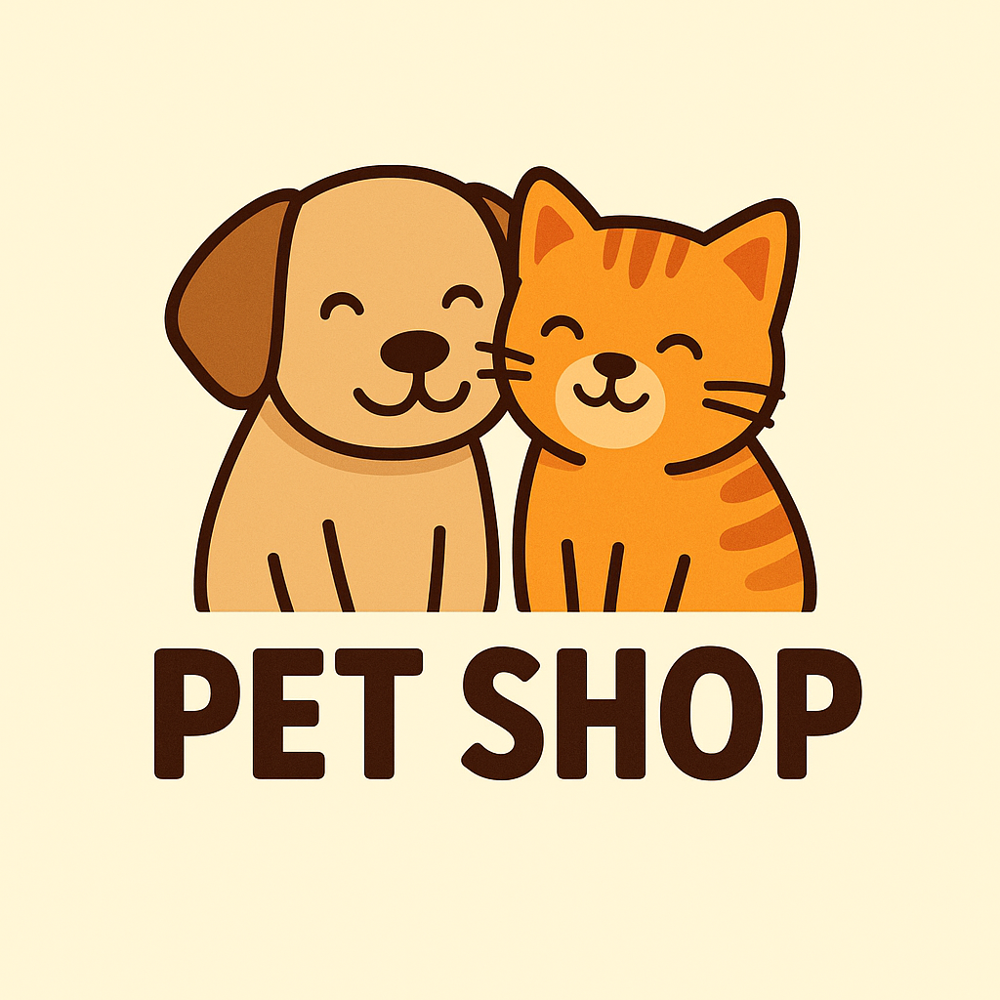

# Projeto Pet Shop

> Sistema de gestão de petshop com foco na informatização dos serviços prestados. O sistema permitirá o cadastro de proprietários e seus animais, o agendamento de serviços estéticos e veterinários, o registro de atendimentos, além do controle de vacinação Também contemplará o cadastro de profissionais, gerenciamento de raças e consultas ao histórico clínico dos animais.

### Ajustes e melhorias

O projeto ainda está em desenvolvimento e as próximas atualizações serão voltadas para as seguintes tarefas:

- [ ] Inicializar desenvolviemto das principais funcionalidades.
- [ ] Tarefa 2
- [ ] Tarefa 3
- [ ] Tarefa 4
- [ ] Tarefa 5
